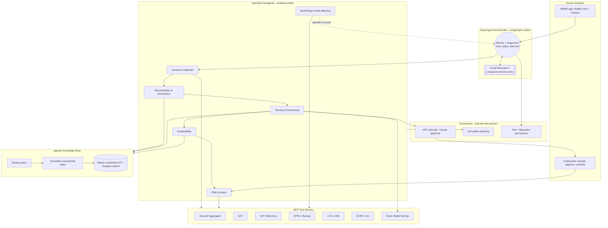

# 02 — System Architecture

*Output of the AI-Architect lens. Greenfield design for an agentic credit-underwriting OS that a bank can actually deploy. Orchestration is **Deep Agents + LangGraph** (no A2A, no Temporal for now — see "Deferred" below).*

---

## Quick read of what we're building
A **deep agent** (the orchestrator) that runs the credit-invisible-MSME underwriting workflow by planning the job and delegating to **specialist subagents** running in isolated context windows. It reaches external systems through **MCP tool servers**, grounds every decision in an **agentic knowledge brain** (Docling → CocoIndex → GBrain), and **pauses for human approval** at the credit decision using Deep Agents' built-in human-in-the-loop. Agent working state (canonical data, reconciliation notes, audit refs) is **stored in the Deep Agents virtual filesystem + long-term memory store**, so context stays small across a long run. The credit decision itself is made by a **deterministic, versioned ML model**, never by an LLM.

## Primary architectural goals (priority order — this is credit)
1. **Accuracy & explainability** — every decision reproducible and defensible to a risk team/regulator.
2. **Reliability & auditability** — durable runtime, no lost state, immutable trail, bounded loops.
3. **Trust / guardrails** — HITL on real decisions, scoped tool/file permissions, sandboxing.
4. **Scalability** — stateless workers, LangGraph runtime + store, a continuously-fresh knowledge index.
5. **Latency** — near-real-time via parallel ingestion, context offload, and right-sized models — never at the cost of #1.

## Agent topology



## The agents (a deep agent + its subagents)
The **orchestrator** is a top-level deep agent: it plans with `write_todos`, then spawns specialist **subagents** via the built-in `task` tool so each runs in its own clean context (this is what keeps a long underwriting run reliable). Full contracts in `03-agent-specs.md`.

- **Orchestrator (Planner + Supervisor).** Decomposes the job, sequences subagents, handles branching (e.g., thin-file path), and owns the HITL pause. Routing only — never credit math.
- **Consent & Ingestion subagent.** Drives AA consent, then pulls bank/GST/UPI/EPFO in parallel; normalises to a canonical schema; writes the raw + canonical data to the **virtual filesystem** (not into the prompt) so downstream subagents read files, not bloated context.
- **Reconciliation & Enrichment subagent.** The hard last mile: cross-checks turnover across GST vs bank vs UPI, resolves disagreements, flags fraud/gaming, tags seasonality, derives model features. Consults the knowledge brain for sector norms/fraud patterns.
- **Scoring & Decisioning subagent.** Calls the **deterministic model service** for the multidimensional score + eligibility, checks it against credit policy retrieved from the knowledge brain, emits a recommendation.
- **Explainability subagent.** Turns SHAP drivers + policy hits into plain-language/vernacular narratives and the structured audit rationale; faithfulness-checked against the model output.
- **Offer & Action subagent.** Runs only after the HITL approval clears: generates the OCEN/ULI offer, opens/advances the loan in the LOS, requests missing docs. The only agent with write/action permissions.
- **Monitoring & Early-Warning subagent.** Post-disbursal, periodically re-ingests fresh signals and re-scores to flag emerging stress (the "portfolio quality" outcome). Read-only.

## Deep Agents capabilities we use (and where)
This is the "agentic features + storage" layer the brief asks us to showcase — all built into the harness, so we configure rather than build:

| Capability | How CredSight uses it |
|---|---|
| **Planning (`write_todos`)** | Orchestrator decomposes each application into tracked steps; visible in the demo |
| **Subagents (`task`)** | Each specialist runs in isolated context; async subagents for the long-running monitor |
| **Virtual filesystem (pluggable backends)** | **Store** raw/canonical data, reconciliation notes, SHAP outputs, draft explanations as files — context stays lean. Backend = LangGraph store (swap to disk/custom as needed) |
| **Long-term memory store** | Persist MSME profiles, prior assessments, and override history across sessions/threads |
| **Context compression / summarization** | Offload large tool results to files + summarize old turns so long runs don't blow the window |
| **Human-in-the-loop (interrupt)** | The credit-decision approval gate — pause, surface to the underwriter, resume |
| **Filesystem + tool permissions** | Least-privilege: ingestion can read AA but can't book a loan; only the action subagent can, post-approval |
| **Skills** | Reusable domain workflows (e.g., "assess thin-file micro-enterprise") packaged as skills |
| **Smart defaults / system prompts** | Opinionated prompts that make agents plan-before-acting and verify work |

```python
# Orchestrator sketch (deepagents)
from deepagents import create_deep_agent

orchestrator = create_deep_agent(
    model="anthropic:claude-sonnet-4-6",
    tools=[ingest_tools, knowledge_search, score_model_predict, action_tools],
    system_prompt=UNDERWRITING_SYSTEM_PROMPT,
    subagents=[ingestion, reconciliation, scoring, explainability, action, monitoring],
    # HITL on the money-moving tools; store backend persists working files + memory
)
```

## The governance layer (the part that makes it buyable)
Cross-cuts everything; mostly configured *through* the harness rather than hand-built:
- **HITL approval gate.** Decisions over a configurable amount/risk, every auto-reject, and low-confidence cases trigger a Deep Agents **interrupt**: the run pauses, the underwriter sees the recommendation + explanation + evidence and approves / overrides / requests info, then the run resumes. Identity + reason captured.
- **Immutable audit log.** Append-only record of every state transition, data source pulled (with consent-artefact ref), model version + inputs + outputs, every tool action, and every human decision — written through a logged action tool and mirrored to the store. This is your demo's trust centrepiece.
- **Permissions.** Deep Agents **filesystem permission rules** + per-subagent tool scoping enforce least privilege; AA consent scope is enforced at the tool boundary.
- **Sandbox.** All synthetic data / sandbox APIs; no production money movement during the challenge.

## The agentic knowledge brain (replaces generic RAG)
Not a chat-over-PDFs wrapper — a brain the agents read *and write* to:
1. **Docling** parses the bank's credit-policy, scheme-eligibility, and product PDFs into clean structured Markdown/JSON, preserving tables and layout (with page/bbox metadata for precise grounding).
2. **CocoIndex** runs the incremental pipeline — chunk, embed, and upsert into the vector store **and** a knowledge graph — reprocessing only changed docs so policy stays fresh with zero full re-index.
3. **GBrain** is the agentic knowledge base: Markdown is the source of truth, a Postgres (or PGLite) hybrid index makes it searchable, and MCP connects it to the agents. Agents **capture** new derived knowledge (e.g., a newly observed fraud pattern), **search** policy/sector norms at decision time, and a nightly **organize/"dream" cycle** keeps the graph self-wiring. That read-*and*-write loop is what makes it a brain rather than a static index.

Grounding rule: Decisioning and Explainability retrieve only the policy clauses that apply to this applicant's segment — no context stuffing — and every retrieved clause is cited in the audit rationale.

## Orchestration & durability
- **LangGraph runtime** provides durable execution, streaming, checkpointing, and the HITL interrupt primitives — so a half-finished assessment (slow AA fetch, pending human approval) survives and resumes without restarting.
- **Deep Agents** sits on top as the harness (planning, subagents, filesystem, memory, permissions).
- **Deferred (integrate later):** **Temporal** for heavy, long-horizon, cross-service durability (e.g., fleet-scale monitoring with retries/SLAs) and **A2A** for cross-org agent federation. Neither is needed for the challenge build; the architecture leaves clean seams so they slot in without a rewrite.

## Tech-stack mapping

| Concern | Choice | Why |
|---|---|---|
| Agent harness | **Deep Agents (`deepagents`)** | Planning, subagents, virtual FS, memory, HITL, permissions out of the box |
| Runtime / orchestration | **LangGraph** | Durable execution, streaming, checkpointing, interrupts |
| Multi-agent | Deep Agents **subagents** (`task`) | Isolated context per specialist → reliability |
| Tool/data integration | **MCP servers** (one per system) | Typed, permissioned, swappable synthetic→sandbox |
| Knowledge brain | **Docling → CocoIndex → GBrain** | Parse → keep-fresh index → read/write agentic KG |
| Decisioning | Python service: XGBoost/sklearn + SHAP, versioned | Deterministic, auditable, explainable — never an LLM |
| LLM usage | Small model for routing/classification; larger for reconciliation + explanations | Right-size per task |
| Working state / memory | Deep Agents **virtual filesystem + LangGraph store** | Store canonical data, notes, audit refs; lean context |
| Primary store | PostgreSQL | Profiles, scores, applications; also GBrain's search index + CocoIndex state |
| Observability | LangSmith + OpenTelemetry | Trace the agent graph; eval loop on score + explanation quality |
| Deferred | Temporal (durability at scale), A2A (federation) | Slot in later via clean seams |

## Reliability & fault tolerance
- LangGraph checkpoints state at each node; a crash mid-assessment resumes, it doesn't restart.
- Every MCP tool call has retries + timeouts + a defined partial-success path (GST down → proceed with a flagged lower-confidence assessment).
- Subagent loops are bounded (max iterations, wall-clock timeout) to prevent runaway cost/latency.
- LLM calls have fallbacks (smaller model / cached template) so explanation generation never blocks a decision.
- Action tools are idempotent (idempotency key prevents double-booking a loan).

## Scalability
- Subagents are stateless; state lives in the LangGraph store + Postgres, so workers scale horizontally.
- Ingestion fans out per data source in parallel; the monitor runs as an async subagent off the request path.
- CocoIndex keeps the knowledge index fresh incrementally (no full re-embed); static policy embeddings are computed once.

## Accuracy & output quality
- The score is a versioned model with a fixed feature pipeline → reproducible and back-testable.
- Explanations are constrained to the model's actual SHAP drivers + retrieved policy clauses (faithfulness check) — no plausible-sounding fiction.
- A thin-file **confidence** travels with every decision; low-data cases are surfaced honestly and routed to the human gate.
- An eval harness scores decision quality (vs synthetic ground truth) and explanation faithfulness in CI.

## The one thing to do first
**Build the deterministic scoring service + reconciliation logic on synthetic data before any agent wiring.** It's the substance and the moat; Deep Agents + LangGraph then wrap a core that already works. If that core is real and explainable, the rest is harness configuration you can move through fast.

*Open question to settle next: what amount/risk threshold auto-flows to the HITL interrupt vs. surfaces as a fully-automated recommendation — i.e., how much autonomy does the bank's risk appetite allow in the sandbox? That one parameter shapes the whole demo narrative.*
